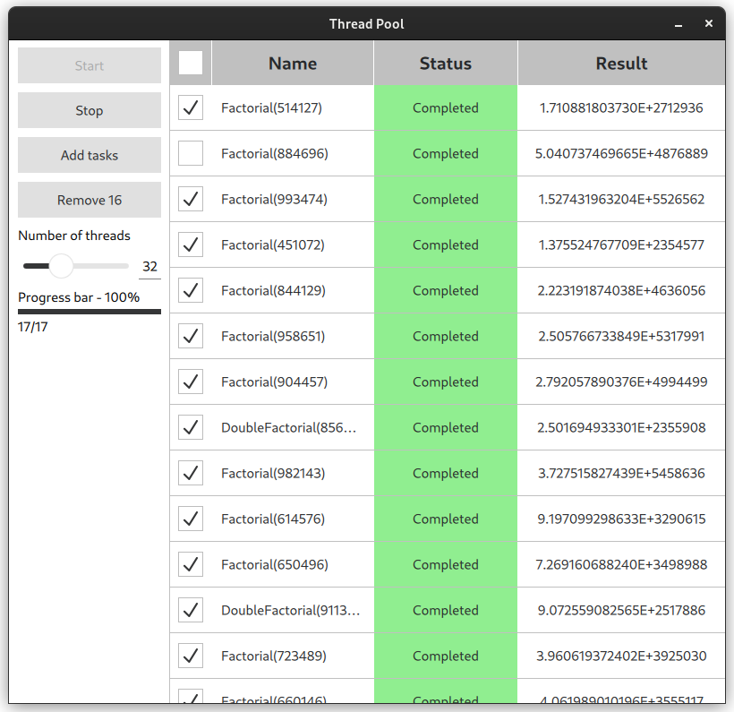
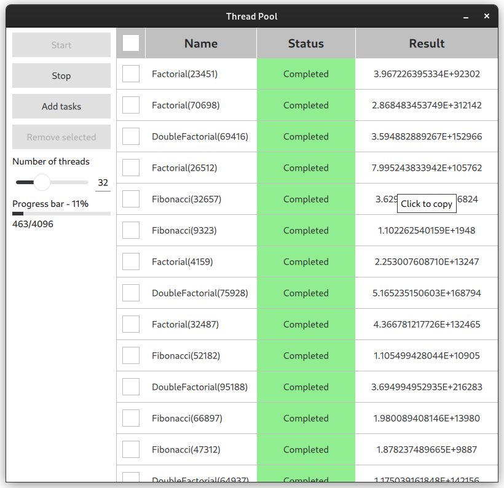
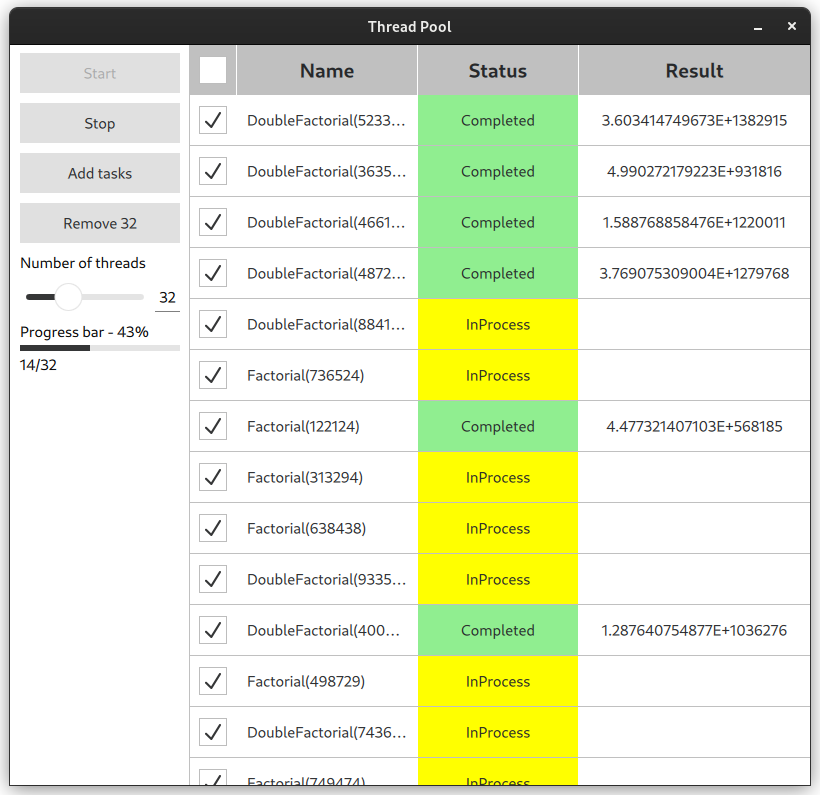

### Simple QML thread pool app

  
   
  

[output.webm](https://user-images.githubusercontent.com/32819769/222419858-9dcac667-c9c4-4019-a905-84a54b377fe6.webm)

#### Build and run from source
mkdir build && cd build \
cmake .. && make -j $(( $(nproc) + 1 )) \
./qml_threadpool

#### Build and run using docker
make
